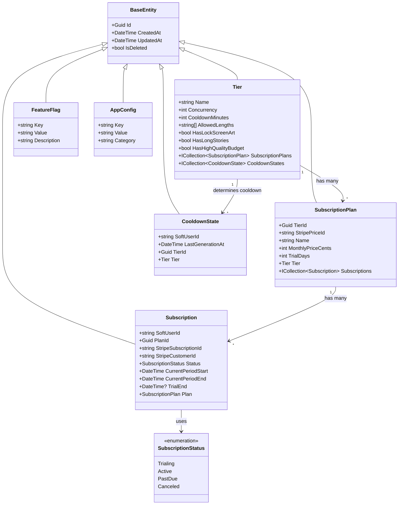
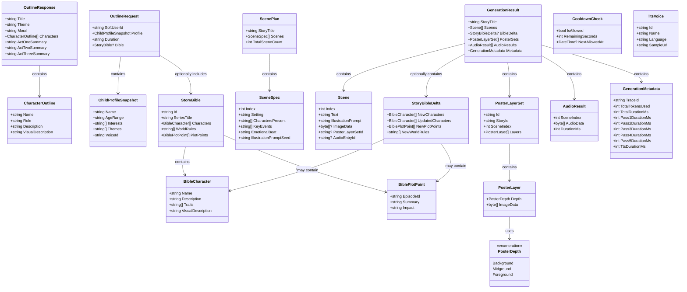
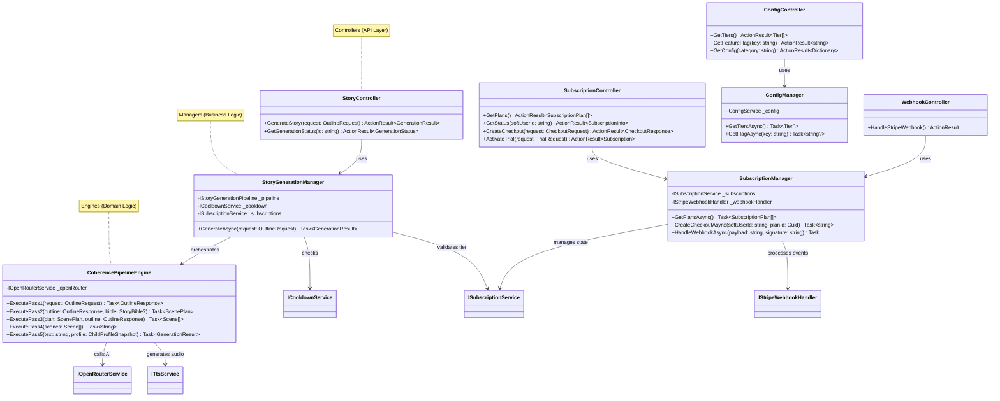

# TaleWeaver — Class Diagrams

> Mermaid class diagrams for backend entities, service interfaces, and pipeline DTOs.

---

## 1 Backend Entities

---

## 2 Backend Service Interfaces

```mermaid
classDiagram
    class IOpenRouterService {
        <<interface>>
        +GenerateTextAsync(prompt: string, model: string) Task~string~
        +GenerateImageAsync(prompt: string, model: string) Task~byte[]~
        +GenerateTextStreamAsync(prompt: string, model: string) IAsyncEnumerable~string~
    }

    class IStoryGenerationPipeline {
        <<interface>>
        +GenerateOutlineAsync(request: OutlineRequest) Task~OutlineResponse~
        +PlanScenesAsync(outline: OutlineResponse, bible: StoryBible?) Task~ScenePlan~
        +GenerateSceneBatchAsync(plan: ScenePlan, outline: OutlineResponse) Task~Scene[]~
        +StitchScenesAsync(scenes: Scene[]) Task~string~
        +PolishStoryAsync(stitchedText: string, profile: ChildProfileSnapshot) Task~GenerationResult~
        +ExecuteFullPipelineAsync(request: OutlineRequest) Task~GenerationResult~
    }

    class IStripeWebhookHandler {
        <<interface>>
        +HandleCheckoutCompletedAsync(session: StripeSession) Task
        +HandleInvoicePaidAsync(invoice: StripeInvoice) Task
        +HandleInvoicePaymentFailedAsync(invoice: StripeInvoice) Task
        +HandleSubscriptionDeletedAsync(subscription: StripeSubscription) Task
        +HandleSubscriptionUpdatedAsync(subscription: StripeSubscription) Task
        +ValidateSignatureAsync(payload: string, signature: string) Task~bool~
    }

    class ITtsService {
        <<interface>>
        +SynthesizeAsync(text: string, voiceId: string) Task~byte[]~
        +GetAvailableVoicesAsync() Task~TtsVoice[]~
        +SynthesizeScenesAsync(scenes: Scene[], voiceId: string) Task~AudioResult[]~
    }

    class ICooldownService {
        <<interface>>
        +CheckCooldownAsync(softUserId: string) Task~CooldownCheck~
        +RecordGenerationAsync(softUserId: string) Task
        +GetRemainingSecondsAsync(softUserId: string) Task~int~
    }

    class ISubscriptionService {
        <<interface>>
        +GetActiveSubscriptionAsync(softUserId: string) Task~Subscription?~
        +GetTierAsync(softUserId: string) Task~Tier~
        +CreateTrialAsync(softUserId: string) Task~Subscription~
        +CreateCheckoutSessionAsync(softUserId: string, planId: Guid) Task~string~
    }

    class IConfigService {
        <<interface>>
        +GetFeatureFlagAsync(key: string) Task~string?~
        +GetAppConfigAsync(key: string) Task~string?~
        +GetAppConfigByCategoryAsync(category: string) Task~Dictionary~string, string~~
        +GetTiersAsync() Task~Tier[]~
        +GetPlansAsync() Task~SubscriptionPlan[]~
    }

    IStoryGenerationPipeline ..> IOpenRouterService : depends on
    IStoryGenerationPipeline ..> ITtsService : depends on
    IStoryGenerationPipeline ..> ICooldownService : depends on
    IStoryGenerationPipeline ..> ISubscriptionService : checks tier
```

---

## 3 Pipeline DTOs

---

## 4 iDesign Layer Architecture

