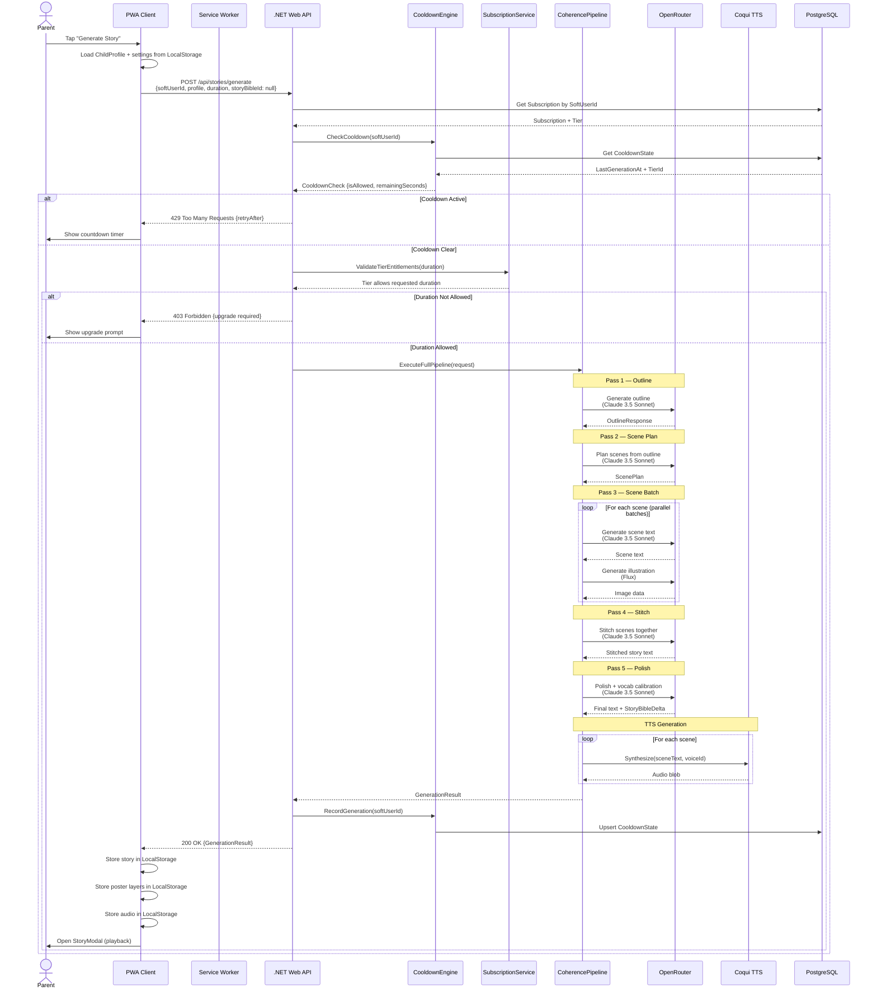
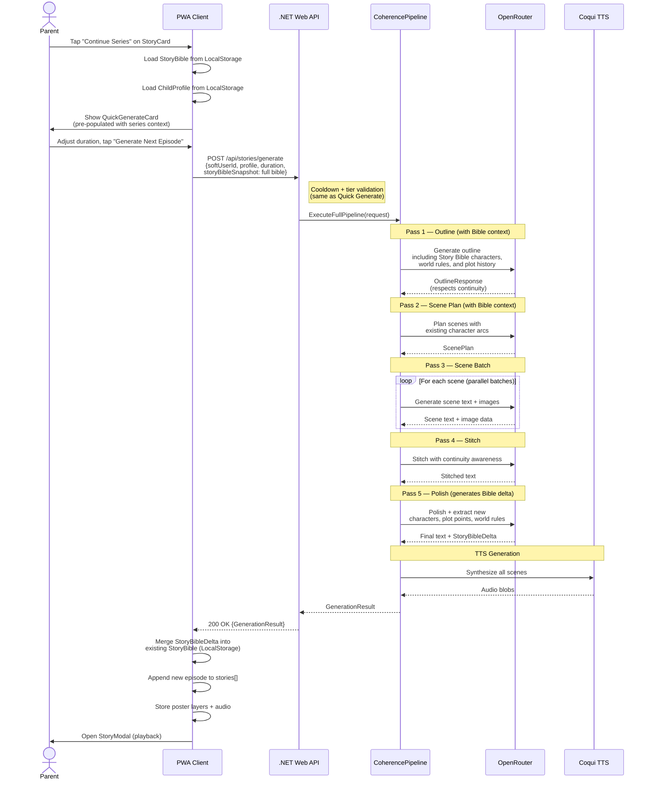
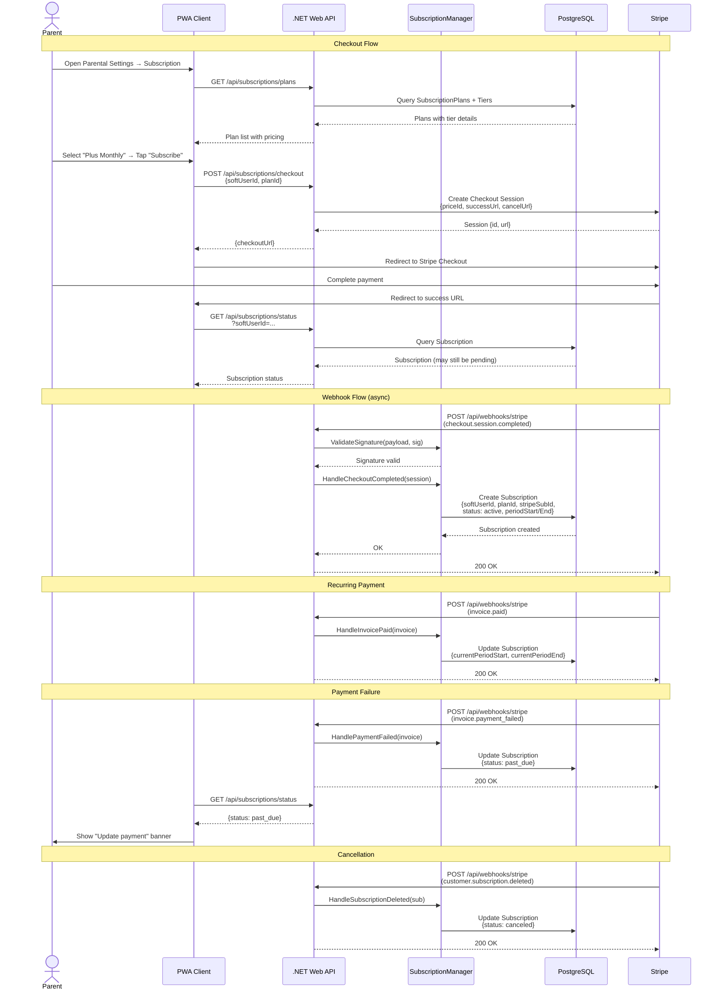
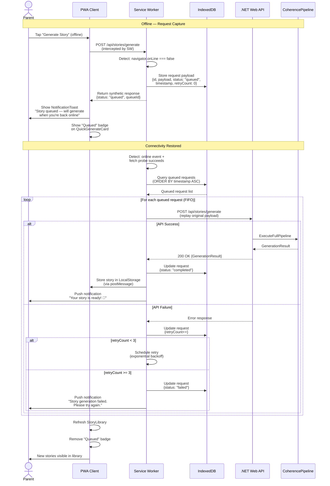
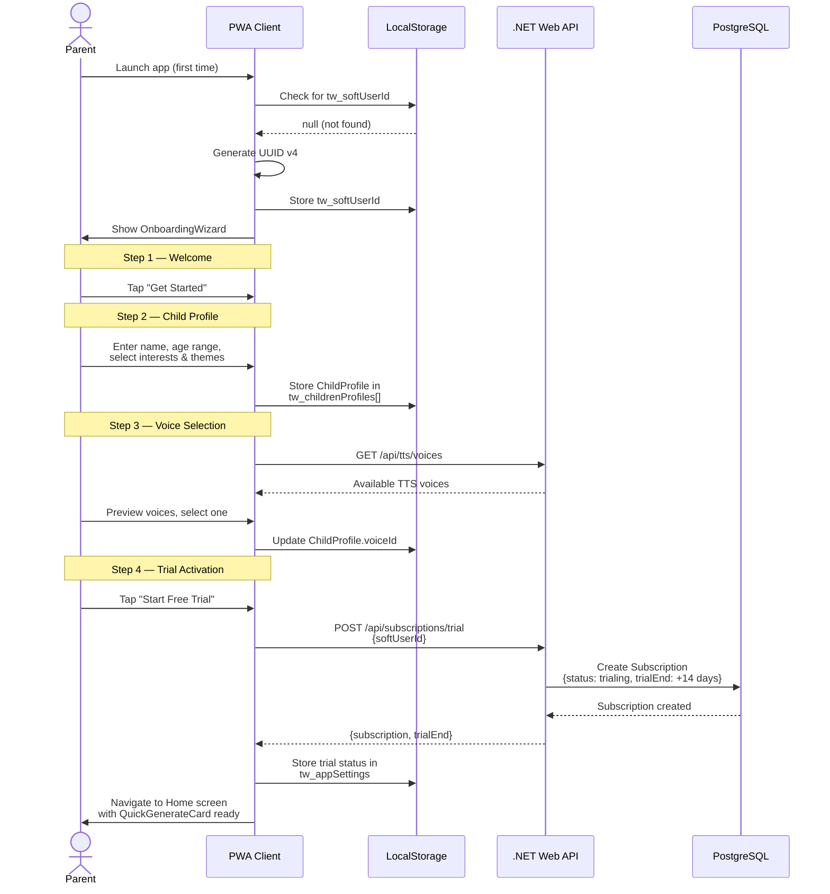

# TaleWeaver — Sequence Diagrams

> Mermaid sequence diagrams for the primary system flows.

---

## 1 Quick Generate Flow

Full story generation from user tap to playback-ready result.

---

## 2 Series Continuation Flow

Generating a new episode using an existing Story Bible for continuity.

---

## 3 Stripe Subscription Flow

Checkout initiation, payment, and webhook-driven state synchronization.

---

## 4 Offline Queue Flow

Service Worker capture, storage, replay, and notification when connectivity returns.

---

## 5 Onboarding Flow

First-launch experience from app open to trial activation.

