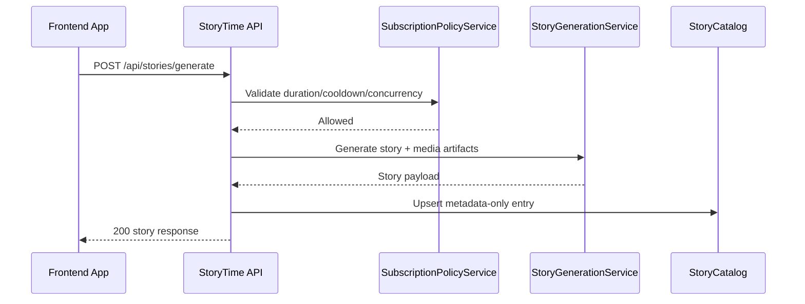
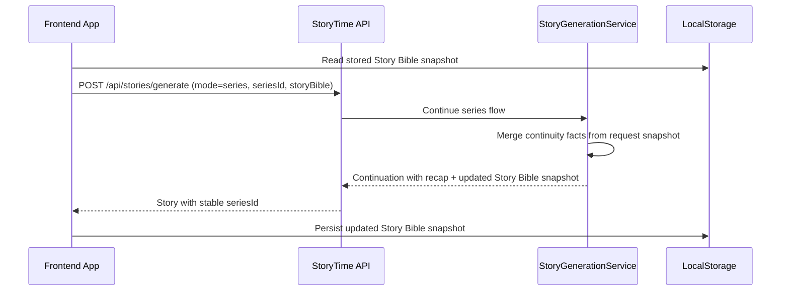
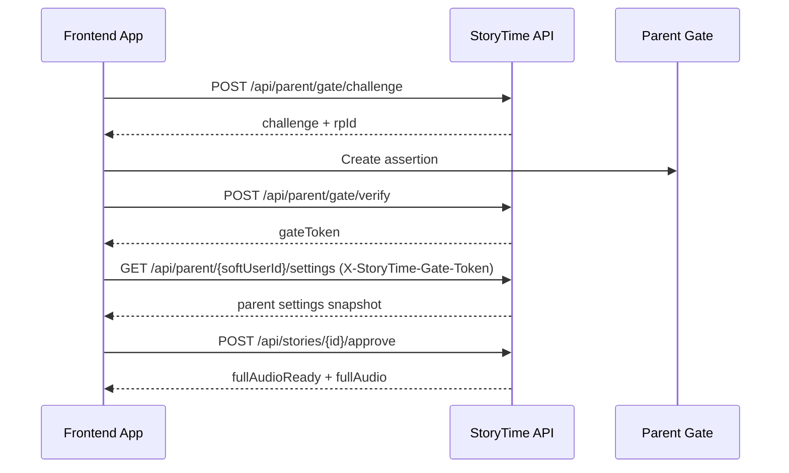
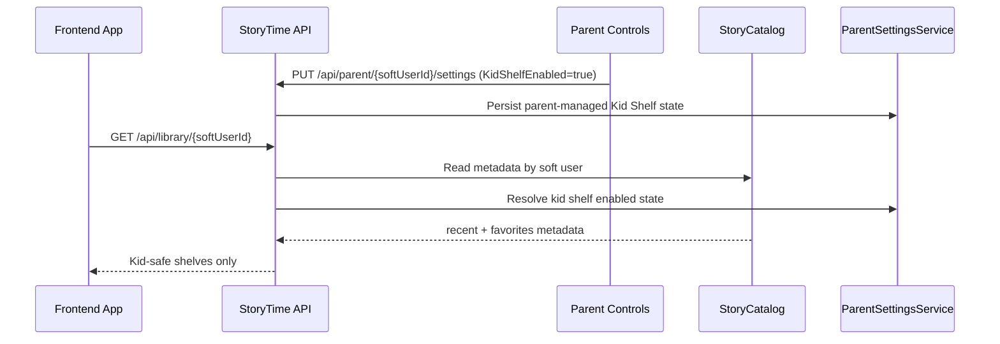
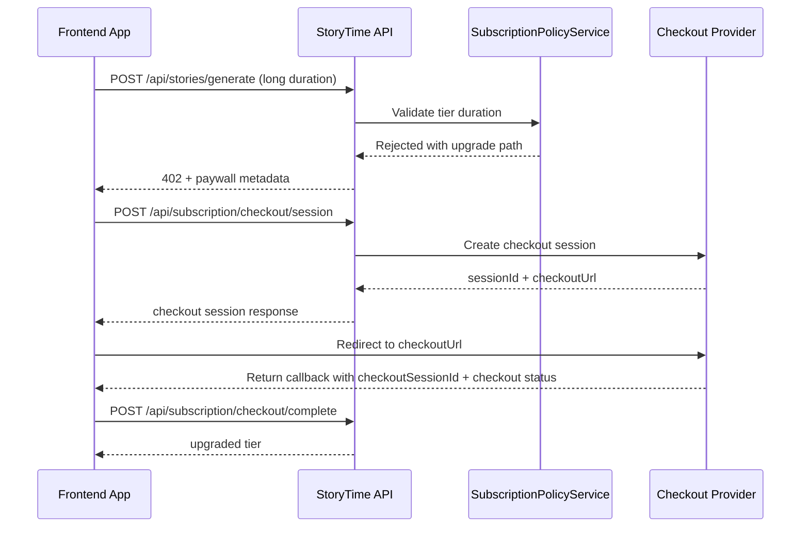

# Sequence Summary

## UC-001 Quick Generate

```mermaid
sequenceDiagram
  participant UI as Frontend App
  participant API as StoryTime API
  participant Policy as SubscriptionPolicyService
  participant Gen as StoryGenerationService
  participant Catalog as StoryCatalog

  UI->>API: POST /api/stories/generate
  API->>Policy: Validate duration/cooldown/concurrency
  Policy-->>API: Allowed
  API->>Gen: Generate story + media artifacts
  Gen-->>API: Story payload
  API->>Catalog: Upsert metadata-only entry
  API-->>UI: 200 story response
```

## UC-002 Series Continuation

```mermaid
sequenceDiagram
  participant UI as Frontend App
  participant API as StoryTime API
  participant Gen as StoryGenerationService
  participant LS as LocalStorage

  UI->>LS: Read stored Story Bible snapshot
  UI->>API: POST /api/stories/generate (mode=series, seriesId, storyBible)
  API->>Gen: Continue series flow
  Gen->>Gen: Merge continuity facts from request snapshot
  Gen-->>API: Continuation with recap + updated Story Bible snapshot
  API-->>UI: Story with stable seriesId
  UI->>LS: Persist updated Story Bible snapshot
```

## UC-003 Parent Approval

```mermaid
sequenceDiagram
  participant UI as Frontend App
  participant API as StoryTime API
  participant Gate as Parent Gate

  UI->>API: POST /api/parent/gate/challenge
  API-->>UI: challenge + rpId
  UI->>Gate: Create assertion
  UI->>API: POST /api/parent/gate/verify
  API-->>UI: gateToken
  UI->>API: GET /api/parent/{softUserId}/settings (X-StoryTime-Gate-Token)
  API-->>UI: parent settings snapshot
  UI->>API: POST /api/stories/{id}/approve
  API-->>UI: fullAudioReady + fullAudio
```

## UC-004 Kid Shelf

```mermaid
sequenceDiagram
  participant UI as Frontend App
  participant API as StoryTime API
  participant Parent as Parent Controls
  participant Catalog as StoryCatalog
  participant Settings as ParentSettingsService

  Parent->>API: PUT /api/parent/{softUserId}/settings (KidShelfEnabled=true)
  API->>Settings: Persist parent-managed Kid Shelf state
  UI->>API: GET /api/library/{softUserId}
  API->>Catalog: Read metadata by soft user
  API->>Settings: Resolve kid shelf enabled state
  Catalog-->>API: recent + favorites metadata
  API-->>UI: Kid-safe shelves only
```

## UC-005 Tier and Cooldown

```mermaid
sequenceDiagram
  participant UI as Frontend App
  participant API as StoryTime API
  participant Policy as SubscriptionPolicyService
  participant Checkout as Checkout Provider

  UI->>API: POST /api/stories/generate (long duration)
  API->>Policy: Validate tier duration
  Policy-->>API: Rejected with upgrade path
  API-->>UI: 402 + paywall metadata
  UI->>API: POST /api/subscription/checkout/session
  API->>Checkout: Create checkout session
  Checkout-->>API: sessionId + checkoutUrl
  API-->>UI: checkout session response
  UI->>Checkout: Redirect to checkoutUrl
  Checkout-->>UI: Return callback with checkoutSessionId + checkout status
  UI->>API: POST /api/subscription/checkout/complete
  API-->>UI: upgraded tier
```
